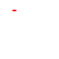

# CYBER CERTIFICATIONS, ROAD MAPS AND LEARNING PATHWAYS

## Vendor Index - Cybersecurity Certifications

****

**OSCP (via PEN-200)** — Hands-on penetration testing cert proving ability to enumerate, exploit, and escalate on Linux/Windows targets.
**Price:** Course + Exam Bundle $1,749 (one-time) • Learn One $2,749/year • Learn Unlimited $6,099/year.
**Free?** No.

**OSEP (via PEN-300)** — Advanced evasion & AD/defense bypass techniques for experienced pentesters.
**Price:** same pricing options as above (bundle or subscriptions).
**Free?** No.

**OSWE (via WEB-300)** — Web application exploit development; white-box code review for RCE.
**Price:** bundle/subscription as above.
**Free?** No.

**OSED (via EXP-301)** — Windows user-mode exploit development (stack/heap, ROP, DEP/ASLR bypass).
**Price:** bundle/subscription as above.
**Free?** No.

**OSEE (via EXP-401)** — Advanced Windows exploitation; kernel/mitigation bypass (expert-level).
**Price:** bundle/subscription as above.
**Free?** No.

**OSDA (via SOC-200)** — Defensive Blue Team cert focused on SOC processes, SIEM, IR, and detection engineering.
**Price:** bundle/subscription as above.
**Free?** No.

**SJD-100: Secure Java Development Essentials** — Secure coding for Java; foundational AppSec practices.
**Price:** $899 one-time (1 year access).
**Free?** No.

**eJPT** — Entry-level practical junior pentesting cert (network/web basics, enumeration, exploitation).
**Price:** Voucher only or bundle pricing varies; commonly offered via Premium bundles; expect ~$399–$599 depending on promo.
**Free?** No.

**eCPPT** — Practical professional pentesting (end-to-end engagement incl. reporting).
**Price:** Voucher-only available to Premium subscribers; popular **eCPPT + 3 months Premium** bundle around ~$599.
**Free?** No.

**eCTHP** — Certified Threat Hunting Professional (blue-team hunting across endpoints/network).
**Price:** Voucher-only for Premium subscribers • **eCTHP + 3 months Premium** bundle commonly ~$599 (varies by promo).
**Free?** No.

**PSAA (Practical SOC Analyst Associate)** — Hands-on SOC foundations: triage, SIEM, detection basics.
**Price:** $200.
**Free?** No.

**PJPT (Practical Junior Penetration Tester)** — Entry-level pentest exam (web/network, enumeration → report).
**Price:** $249.
**Free?** No.

**PNPT (Practical Network Penetration Tester)** — AD-focused black-box pentest (OSINT → foothold → lateral movement → report + debrief).
**Price:** $399.
**Free?** No.

**CCNA (200-301)** — Associate networking: routing/switching, IP services, security fundamentals, automation.
**Price:** $300 per exam attempt.
**Free?** No.

**Cybersecurity Associate (CBROPS 200-201)** — Associate SOC fundamentals: monitoring, host/network analysis, policies.
**Price:** $300.
**Free?** No.

**Cybersecurity Professional (CBRCOR 350-201 + concentration)** — Professional-level CyberOps; one core ($400) + one concentration ($300).
**Price:** ~$700 total exams (core + concentration).
**Free?** No.

**CC – Certified in Cybersecurity** — Entry-level security foundations; pathway into SOC/analyst roles.
**Price:** **Free training + free exam** via One Million Certified (limited-time). Annual Maintenance Fee (AMF) $50 after passing.
**Free?** **Yes (exam + training)**; AMF applies post-pass.

**SSCP** — Admin-level security operations & implementation across seven CBK domains.
**Price:** ~$249 exam (regional pricing). AMF $125/year (pro-level), or $50 if only holding CC-tier.
**Free?** No.

**CISSP** — Senior-level security leadership/architecture/engineering across eight domains.
**Price:** ~$749 exam (regional pricing). AMF $135/year.
**Free?** No.

**A+ (Core 1 & 2)** — Support/endpoint fundamentals (hardware, OS, troubleshooting).
**Price:** ~$253 per exam (2 exams).
**Free?** No (regional funding may exist).

**Network+** — Network implementation/troubleshooting.
**Price:** ~$358–$369.
**Free?** No (regional funding may exist).

**Security+** — Baseline security: threats, risk, crypto, architecture.
**Price:** ~**$425** (US MSRP in 2025).
**Free?** No.

**CySA+** — Blue-team analyst skills: threat detection, analysis, response.
**Price:** ~**$392** (US typical).
**Free?** No.

**CPTS (Certified Penetration Testing Specialist)** — Practical pentesting across HTB boxes/labs with reporting.
**Price:** **$490** (includes labs + exam).
**Free?** No.

**CBBH (Certified Bug Bounty Hunter)** — Web app bug hunting methodology with practical exam.
**Price:** **$490**.
**Free?** No

**CWEE (Certified Web Exploitation Expert)** — Advanced web exploitation (manual techniques) with hands-on exam.
**Price:** **$490**.
**Free?** No.

**CDSA (Certified Defensive Security Analyst)** — Blue-team SOC analyst practical.
**Price:** **$490**.
**Free?** No.

**CRTO – Red Team Ops** — Adversary simulation & C2 ops (Cobalt Strike), OPSEC, defense evasion; 48h practical exam.
**Price:** Course £349–£399 typical; bundle options available (often includes 1 exam).
**Free?** No.

**CRTO II – Red Team Ops II** — Advanced defense evasion, AD tradecraft; 96h exam.
**Price:** Course-only **£399** • with 30/60/90 days lab £429/£459/£489.
**Free?** No.

**CCD – Certified CyberDefender** — Hands-on SOC/DFIR/hunting; 48-hour practical exam within 4-day window.
**Price:** **$800** (includes training + 2 exam attempts).
**Free?** No.

**BTL1 – Blue Team Level 1** — Junior SOC: phishing, DFIR, TI, SIEM, IR.
**Price:** **£399** (includes 4 months content + labs + exam + one free retake).
**Free?** No. Student/military discounts available.

**BTL2 – Blue Team Level 2** — Advanced SOC: malware analysis, threat hunting, vuln mgmt, advanced SIEM.
**Price:** **£1,999** (approx. 5 months access).
**Free?** No.

**Google IT Support Professional Certificate** — Job-ready IT support fundamentals; prep for CompTIA A+.
**Price:** **~$49/month** on Coursera (subscription).
**Free?** No (7day free trial standard).

**Google Cybersecurity Professional Certificate** — SOC analyst tooling (SIEM, SOAR), detection basics, incident handling.
**Price:** **~$49/month** on Coursera.
**Free?** No (trial available).

**SOC Level 1 (Pathway)** — Guided blue-team path (Windows/Linux basics, SIEM, IR fundamentals).
**Price:** Requires **TryHackMe subscription** (monthly/annual tiers).
**Free?** No (some rooms free; full path needs Premium).

**SOC Level 2 (Pathway)** — Intermediate SOC/hunting/DFIR modules with hands-on labs.
**Price:** Included with active subscription.
**Free?** No.

**SAL1 – Security Analyst Level 1** — Entrylevel defensive SOC certification combining multiplechoice questions with two SOC simulator scenarios. 24hour exam window; validates threat detection, alert triage, case reporting, and incident response.
**Price:** **€349** (includes **3 months Premium** learning) **or €297** for existing Premium subscribers. Includes **1 free retake**.
**Free?** No.

**PT1 – Jr Penetration Tester** — Handson pentesting certification covering **AppSec, NetSec, and Active Directory** with a realworld engagement feel and a required professional report. **48hour** exam window. Includes **3 months Premium** learning and **1 free retake**.
**Price:** **€297** (with **15% discount** if you already have Premium).
**Free?** No.

## CyberSecurity BlueTeam RoadMap

### BASICS

### Level 1

CompTIA A+ certificate

[https://www.cisco.com/site/us/en/learn/training-certifications/certifications/cybersecurity/associate/index.html](https://www.cisco.com/site/us/en/learn/training-certifications/certifications/cybersecurity/associate/index.html)

Google cybersecurity certificate

[Google cybersecurity certificate](https://www.coursera.org/professional-certificates/google-cybersecurity?utm_medium=sem&utm_source=gg&utm_campaign=b2c_emea_google-cybersecurity_google_ftcof_professional-certificates_cx_dr_tt_gg_sem_pr_s1_en_m_hyb_25-08_sbetest&campaignid=22918155259&adgroupid=184004153893&device=c&keyword=google%20cybersecurity%20certificate&matchtype=b&network=g&devicemodel=&creativeid=768176947338&assetgroupid=&targetid=kwd-2044776026767&extensionid=&placement=&gad_source=1&gad_campaignid=22918155259&gclid=Cj0KCQjw8KrFBhDUARIsAMvIApYaHo1Y0jXYStvxfOw-aUGPd4tq-T70H1MesXzD91XSyJ2GYfxllGsaAtBWEALw_wcB)

### Level 2

CompTIA Network+ certificate

[https://www.comptia.org/en-us/certifications/network](https://www.comptia.org/en-us/certifications/network)

Cisco Certified Network Associate

[https://www.cisco.com/site/us/en/learn/training-certifications/exams/ccna.html](https://www.cisco.com/site/us/en/learn/training-certifications/exams/ccna.html)

### Level 3

ISC2 Certified In Cybersecurity

[https://www.isc2.org/certifications/cc](https://www.isc2.org/certifications/cc)

ISC2  Systems Security Certified Practitioner

[https://www.isc2.org/certifications/sscp](https://www.isc2.org/certifications/sscp)

ISC2 Certified Information Systems Security Professional

[https://www.isc2.org/certifications/cissp](https://www.isc2.org/certifications/cissp)

CompTIA Security+ certificate

[https://www.comptia.org/en-us/certifications/security](https://www.comptia.org/en-us/certifications/security)

CompTIA CySA+ certificate

[https://www.comptia.org/en-us/certifications/cybersecurity-analyst](https://www.comptia.org/en-us/certifications/cybersecurity-analyst)

### Level 4

Cisco Cybersecurity Associate certification

[https://www.cisco.com/site/us/en/learn/training-certifications/certifications/cybersecurity/associate/index.html](https://www.cisco.com/site/us/en/learn/training-certifications/certifications/cybersecurity/associate/index.html)

Practical SOC Analyst Associate

[https://certifications.tcm-sec.com/psaa](https://certifications.tcm-sec.com/psaa)

SOC-200: Security Operations and Defensive Analysis

[https://www.offsec.com/courses/soc-200](https://www.offsec.com/courses/soc-200)

TryHackMe SOC Level 1 (pathway!!)

[https://tryhackme.com/path/outline/soclevel1](https://tryhackme.com/path/outline/soclevel1)

Blue Team Level 1 (BTL1)

[https://www.securityblue.team/certifications/blue-team-level-1](https://www.securityblue.team/certifications/blue-team-level-1)

### ADVANCED

### Level 1

Cisco Cybersecurity Professional certification

[https://www.cisco.com/site/us/en/learn/training-certifications/certifications/cybersecurity/professional/index.html](https://www.cisco.com/site/us/en/learn/training-certifications/certifications/cybersecurity/professional/index.html)

TryHackMe SOC Level 2 (pathway!!)

[https://tryhackme.com/path/outline/soclevel2](https://tryhackme.com/path/outline/soclevel2)

Security Analyst Level 1

[https://tryhackme.com/certification/security-analyst-level-1](https://tryhackme.com/certification/security-analyst-level-1)

Blue Team Level 2 (BTL2)

[https://www.securityblue.team/certifications/blue-team-level-2](https://www.securityblue.team/certifications/blue-team-level-2)

Security Analysis Certification

[HTB certification link](https://academy.hackthebox.com/preview/certifications/htb-certified-defensive-security-analyst?irclickid=3P3WrhyZOxycTWJ26EQuh3jtUkpz3hyoPUGwTA0&irgwc=1)

Certified Threat Hunting Professional

[https://ine.com/security/certifications/ecthp-certification](https://ine.com/security/certifications/ecthp-certification)

Certified CyberDefender

[https://cyberdefenders.org/blue-team-training/courses/certified-cyberdefender-certification](https://cyberdefenders.org/blue-team-training/courses/certified-cyberdefender-certification)

## Programming languages

### Languages

Python

Java

C

SQL

PHP

Bash

JavaScript

### Learning platforms

Secure Code Warrior (companies exclusive)

[https://www.securecodewarrior.com](https://www.securecodewarrior.com)

Certifications

SJD-100: Secure Java Development Essentials

[https://www.offsec.com/courses/sjd-100](https://www.offsec.com/courses/sjd-100)

## CyberSecurity RedTeam

### Level 1

Certified Professional Penetration Tester

[https://ine.com/security/certifications/ecppt-certification](https://ine.com/security/certifications/ecppt-certification)

Junior Penetration Tester

[https://ine.com/security/certifications/ejpt-certification](https://ine.com/security/certifications/ejpt-certification)

PEN-200: Penetration Testing with Kali Linux

[https://www.offsec.com/courses/pen-200](https://www.offsec.com/courses/pen-200)

HTB Certified Bug Bounty Hunter

[https://academy.hackthebox.com/preview/certifications/htb-certified-bug-bounty-hunter](https://academy.hackthebox.com/preview/certifications/htb-certified-bug-bounty-hunter)

Penetration Testing Certification

[https://academy.hackthebox.com/preview/certifications/htb-certified-penetration-testing-specialist](https://academy.hackthebox.com/preview/certifications/htb-certified-penetration-testing-specialist)

Red Team Ops I Exam

[https://training.zeropointsecurity.co.uk/courses/red-team-ops](https://training.zeropointsecurity.co.uk/courses/red-team-ops)

Jr Penetration Tester (PT1)

[https://tryhackme.com/certification/junior-penetration-tester](https://tryhackme.com/certification/junior-penetration-tester)

### Level 2

WEB-300: Advanced Web Attacks and Exploitation

[https://www.offsec.com/courses/web-300](https://www.offsec.com/courses/web-300)

EXP-301: Windows User Mode Exploit Development

[https://www.offsec.com/courses/exp-301](https://www.offsec.com/courses/exp-301)

PEN-300: Evasion Techniques and Breaching Defenses

[https://www.offsec.com/courses/pen-300](https://www.offsec.com/courses/pen-300)

Penetration Testing Certification

[https://academy.hackthebox.com/preview/certifications/htb-certified-web-exploitation-expert](https://academy.hackthebox.com/preview/certifications/htb-certified-web-exploitation-expert)

Practical Network Penetration Tester

[https://certifications.tcm-sec.com/pnpt](https://certifications.tcm-sec.com/pnpt)

Red Team Ops II Exam

[https://training.zeropointsecurity.co.uk/pages/red-team-ops-ii-exam](https://training.zeropointsecurity.co.uk/pages/red-team-ops-ii-exam)

### Level 3

EXP-401: Advanced Windows Exploitation

[https://www.offsec.com/courses/exp-401](https://www.offsec.com/courses/exp-401)

## Learning Platforms

### Programming learning platforms

- [**freeCodeCamp**](https://www.freecodecamp.org) — full, free, project-based curriculum.
- [**Codecademy**](https://www.codecademy.com) — interactive coding tracks for many languages.
- [**Codedex**](https://www.codedex.io) 🎮 — gamified coding quests for beginners.
- [**HackerRank**](https://www.hackerrank.com) — practice problems + interview prep tracks.
- [**LeetCode**](https://leetcode.com) — algorithms & data-structures practice (huge problem set).
- [**Exercism**](https://exercism.org) — mentor-guided exercises in many languages.
### CTF platforms

- [**Hack The Box**](https://www.hackthebox.com) — labs & seasonal CTFs from beginner to pro.
- [**picoCTF**](https://picoctf.org) — beginner-friendly annual CTF with always-on practice.
- [**OverTheWire**](https://overthewire.org/wargames) — classic wargames (Bandit, Narnia, etc.).
- [**Root-Me**](https://www.root-me.org/?lang=en) — hundreds of CTF-style challenges across categories.
- [**VulnHub**](https://www.vulnhub.com) — downloadable vulnerable VMs for offline CTF practice.
### Cybersecurity learning platforms (incl. secure coding)

- [**TryHackMe**](https://tryhackme.com/dashboard) 🎮 — guided, hands-on labs (red/blue/purple).
- [**PortSwigger Web Security Academy**](https://portswigger.net/web-security) — superb free web-appsec labs.
- [**PentesterLab**](https://pentesterlab.com) — practical web security & exploitation tracks.
- [**Cybrary**](https://www.cybrary.it) — broad security courses (SOC, pentest, GRC, etc.).
- [**OWASP Cheat Sheet Series**](https://cheatsheetseries.owasp.org) — concise secure-coding best practices.
### Secure coding learning platforms

- [**Secure Code Warrior**](https://www.securecodewarrior.com) 🎮 — gamified secure-coding challenges and tournaments.
- [**Veracode Security Labs**](https://www.veracode.com/products/security-labs) 🎮 — hands-on labs to exploit and fix vulns in safe, containerized apps.
- [**Checkmarx Codebashing**](https://checkmarx.com/product/codebashing-secure-code-training) 🎮 — bite-sized interactive training with developer-friendly integrations.
- [**Security Journey**](https://www.securityjourney.com) (formerly HackEDU) 🎮 — secure development training; HackEDU acquired Security Journey in 2022.
- [**SecureFlag**](https://www.secureflag.com) 🎮 — thousands of hands-on secure-coding labs across 45+ tech stacks.
- [**Kontra (OWASP Top 10 modules)**](https://application.security/free/owasp-top-10) 🎮 — interactive developer training focused on common web risks.